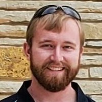

# Syllabus

## CBE 30338 Description

**CBE 30338 Data Analytics, Optimization, and Control** introduces students to the analysis and design of control systems for chemical and biochemical processes. Applications include chemical and biological reactors, separation processes, autonomous biomedical devices, and examples from other engineering disciplines. 

The major topics of the course are:
* Modeling and Parameter Estimation
* Feedback Control
* Process Data Analytics
* Optimization
* Predictive Control

Python and hands-on control experiments are integrated into the course. 

The lab sessions (CBE 32338) provide opportunities for hands-on coding and experimentation using the [Temperature Control Laboratory](./tclab/00.00-tclab.md). In leu of a textbook, students should purchase their own device from [Amazon](https://www.amazon.com/TCLab-Temperature-Control-Lab/dp/B07GMFWMRY) or [apmonitor.com](https://apmonitor.com/pdc/index.php/Main/PurchaseLabKit). 
Apmonitor.com is the first source from where to order the TCLab as sometimes Amazon is out of lab kits.

## Learning Objectives

Students completing this course will be able to:
* Identify process models and fit the models to data
* Design and implement feedback (e.g., advanced PID) control
* Manipulate time series data and extract process information
* Create and solve steady-state optimization models
* Apply the principles of modeling and control to novel applications

## Course Information

**Canvas link:** [SP25-CBE-30338-01 Data Analytics, Optimization, and Control](https://canvas.nd.edu/courses/129145)

**Dates:** January 13 - April 29, 2026. Final on May 8, 1-45 - 3:45 PM

**Class:** CBE 30338 Tuesday and  Thursdays, 9:15 - 10:45 am, DeBartolo Hall 102

**Lab/Tutorial:**  Please try to attend the tutorial for which you are registered:
* CBE 32338-01 Friday, 10:30 am - 11:20 pm, DeBartolo 228
* CBE 32338-02 Friday, 11:30 am - 12:20 pm, DeBartolo 228

Seating in DeBartolo 228 (computer classroom) is limited to 33 students*. Please attend the lab session for which you are registered and you are encouraged to bring your own labtop as there are more students in each session that workstations.

**Prerequisites:** This course assumes knowledge of modeling and analysis with differential equations, procedural programming in Python, mass and energy balances. Students taking this course will normally have completed:

* CBE 20258 Numerical and Statistical Analysis
* MATH 20580 Linear Algebra and Differential Equations (or ACMS equivalent)
* MATH 30650 Differential Equations (or ACMS equivalent)

Students without this background should contact the instructor before registering for the course.

**Required Materials:** The following materials should be acquired at the start of the course.
1. [Temperature Control Lab kit](http://apmonitor.com/pdc/index.php/Main/ArduinoTemperatureControl) is an Arduino based device used in this course as a "hands-on" laboratory for learning the principles and implementation of process control. It is available by on-line order from [Amazon](https://www.amazon.com/TCLab-Temperature-Control-Lab/dp/B07GMFWMRY) or [Apmonitor.com](https://apmonitor.com/pdc/index.php/Main/PurchaseLabKit) for about $50  USD.
2. A laptop/desktop computer with USB-A port, or a USB-C port and a USB-C to USB-A converter.
3. An up-to-date installation of the [Anaconda Individual Edition](https://www.anaconda.com/products/individual)  for Python programming. **Follow the instructions [here](https://appdividend.com/2020/05/12/how-to-update-anaconda-upgrade-anaconda-navigator/) to update an older installation.**

## Instructors and Teaching Assistants

This course is team-taught. **Prof. Jeremiah Zartman** will deliver the lectures. Four teaching assistants will facilitate the labs and tutorials, hold office hours, answer questions on Canvas, and grade the majority of the assignments.

| Role | Name | Photo |
| --- | --- | --- |
| Instructor | [Prof. Jeremiah Zartman](https://engineering.nd.edu/faculty/jeremiah-zartman/) |  |
| Teaching Assistant | Kay Lu |  |
| Teaching Assistant | Caitlin Frank |  |
| Teaching Assistant | Yikang Gong |  |
| Teaching Assistant | TJ Dilenschneider |  |

If you would like a different layout or want me to add TA email addresses and office hours here, tell me which details to include and I will add them.
## ACES Tutors and Study Room

The ACES Study Room program has assigned five peer mentors to support the Spring 2026 CBE Study Room, which includes your CBE30338 course:
Hope Wanken - chwanken@nd.edu

Frannie Webb - fwebb2@nd.edu

Elizabeth O'Connell - eoconne4@nd.edu

Andrew Huffman - ahuffma4@nd.edu

Grace Fluskey - gfluskey@nd.edu

The start date of study room is the Week of Sunday, January 18, 2026

Meeting Times & Location:

Location: 217 Cushing Hall
Sundays: 4-6 PM
Thursdays: 7-9 PM

The ACES tutors are an additional resource to help you master the content in this course. The ACES tutors DO NOT have access to the solutions for the assignments. The ACES tutors do have access to Canvas, including all announcements and the discussion boards. You SHOULD NOT ask the ACES tutorials to see their homework or lab solutions from last year as help.

## Discussion Board (Canvas) and Email Correspondance

* Post your questions to the **discussion board in Canvas**
* Instructor only: jzartman@nd.edu, ''CBE 30338'' in the subject, private official matters (e.g., excused absence, testing accommodations)

We encourage you to post all your questions, including your mathematical models, pseudocode, and code screenshots, to the public **discussion board in Canvas**. We are doing this for a few reasons:
1. As professionals, you'll need to be comfortable asking questions in front of a team. We want to cultivate a positive and friendly learning environment where everyone can practice this skill during the semester.
2. By answering questions in the public discussion board, everyone in the class can access the same information.
3. We would like to cultivate a learning community with peer instruction; as professionals, you must answer your peers' questions.
4. Many scientific software have online discussion boards to ask technical questions and report bugs. Using the **discussion board in Canvas** will help you develop comfort in asking questions this way.

## Required Materials

Required notes and materials for the course are available at the Github/web repositories 

* [ndcbe/controls](https://ndcbe.github.io/controls/Readme.html) 
* [jckantor/TCLab](https://github.com/jckantor/TCLab)

Additional material will be taken from:

* Åström, Karl Johan, and Richard M. Murray. Feedback systems: an introduction for scientists and engineers.  Second Edition (Version v3.1.5 dated 2020-07-24). Princeton University Press. 
* Douglas, Brian. [The Fundamentals of Control Theory]([https://drive.google.com/file/d/1LAjaDDViFG4H7dQ6PQVHo8XSQHS59GJf/view]. See [https://engineeringmedia.com/](https://engineeringmedia.com/) for links to video.

This textbook is available for download from the website (preferred, latest edition with corrections) and Hesburgh Library at https://ebookcentral.proquest.com/lib/ndlib-ebooks/detail.action?docID=475844. 

Additional supplementary materials related to process control will be distributed from time-to-time during the course.

* [Introduction to Python for Science](https://physics.nyu.edu/pine/pymanual/html/pymanMaster.html)
* [BYU Process Dynamics and Control course website](http://apmonitor.com/pdc/index.php/Main/HomePage)
* [Resourcium](https://resourcium.org/)

## Assessment and Grades

Grades for CBE 30338 and CBE 32338 are consolidated into a single grade assigned to CBE 30338. There is no separate grade or credit assigned for CBE 32338.

Grades are based on a weighted assessment of performance in the following categories:

* Class Participation and Professionalism: 5\%
* Assignments: 45\%
* Midterm Exam: 25\%
* Final assessment, which includes a Group Project (15\%) and in-class exam (10\%): 25\%

### Class Participation and Participation 

Class sessions will include opportunities to respond to instructor questions and other active learning exercises. All interactions will be civil, respectful, and inclusive. If you have any concerns about classroom dynamics, please feel free to speak with the instructor.

At the end of the semester, the instructor will assign grades for class participation and professionalism at their discretion. Students who are good class citizens, i.e., actively engage in class and lab activities, work well with peers, arrives prepared, and ask and answer questions on the Canvas discussion board, will receive (near) full marks. In contrast, the following may result in a reduced grade:
- Unprofessional behavior toward peers, instructors, teaching assistants, or others in the campus community. (This may also result in other disciplinary action per university policies.)
- Repeatedly sending emails to the instructor or TAs on topics that should be addressed in the Canvas Discussion board (e.g., assignment help, class policy questions).
- Repeatedly sending emails without "CBE 30338" in the subject.
- Not actively participating in class or lab activities.
- Missing significant numbers of class sessions without an excuse recognized by the university.
- Arriving late to class as this causes a distribution.

The class participation grade may include online quizzes, pre-lab activities, in-class Poll Everywhere questions, and preparation for in-class project consultations.

### Excused Absences

You are expected to attend and actively participate in all class sessions.  If you miss class for an official University excused function, please find notes for that lecture, do the reading, and avail yourself of office hours to catch up on the missed material. You do not need to email the instructor(s) to ask about missed materials. Please check Canvas, the class schedule, and with your classmates first. (You are welcome to post on the Canvas discussion if you miss class.)

We plan on asking two or more Poll Everyone questions each lecture. If you have an excused absence, please submit the supporting documentation [via Canvas](https://canvas.nd.edu/courses/129145/assignments/434956). Please do NOT sent excused absence documentation via email. Canvas provides a more organized way to document excused absences and factor this into the class participation grades. The exception are excused absences from Athletics, which are sent via email directly to the instructors.

### Assignments

Homework and laboratory assignments are critical to developing the skills needed to succeed in the course and in the major. Accordingly, assignments are a required element of the course. Missing assignments will be scored as zero. Group study is encouraged, but the submitted work must be your own. Students must be able to explain all of their submitted work.

Please see our [semester schedule](./Schedule.md) for a listing of assignments and deadlines.

### Exam

There will be two in-class exams. The exam will be open book but without access to a computer or the internet. Students may not use their tablet, watch, phone, or other computing device to access a Python environment, AI tool (e.g., ChatGPT), or the internet during the exam. The exam must be an individual effort.

Students who take notes on a tablet during class should sit in the front rows during the exam and will be monitored by the teaching team. Tablets may only be used to access your notes, i.e., internet and other connectivity must be disabled. To maintain fairness, students who take notes on tablet computers may only access note material they have prepared. For example, students are welcome to access PDF copies of pages on the class website, assignments, etc., they saved and organized on their tablet. This is analogous to someone who took class notes on paper printing out these materials and organizing them into a binder or folder. (The act of saving/printing and organizing class material, or other resources, makes this "your notes" for the purpose of this policy.) Students may not use their tablet to interact with any other individuals or access other resources besides their notes.

### Final Project

The final project for CBE 30338 is in-depth exploration of a dynamic modeling, optimization, or control problem of your choice. You will work in groups (at least three, no more than four, no exceptions), select a problem of interest, and develop an analysis or control design using the skills you learned in this course. 

#### Project Requirements and Scope

Every project must incorporate at least three of the following elements:
- Mathematical modeling including degree of freedom analysis (e.g., states, decisions/controls)
- Feedback control
- Stability/eigenvalue analysis
- State estimation
- Optimization
- Probability theory or stochastic modeling/analysis (this is more complicated than deterministic modeling so it counts as a separate item)
- Data analysis, e.g., regression, uncertainty quantification
- Explore a numerical method, statistical method, or algorithm not taught in CBE 20258
- Use the TCLab hardware
- Use data or a computer/mathematical model from another project, research, or class (with permission from the other instructor or research supervisor)
- Reproduce a mathematical/computer model from literature OR take a mathematical/computer model from literature (e.g., code is published) and perform a new analysis
- Convert a textbook problem from a previous course into a homework problem, similar to Homework 1 or Homework 2, that reinforces key skills from this course (or CBE 20258)
- Use methods/concepts from CBE 30338 not listed above

The three project deliverables are described below and deadlines are given in the .

#### Project Proposal

The first step is to assemble a team of three people (four if needed due to class numbers) with similar topic interests.

As a team, you will write a **two-page project proposal** with up to **one additional page of references** that:
1. Explains the project motivation and goals. Also, briefly explain your personal motivations for choosing this project.
2. Explains the technical approach for the project, especially how the required elements (see list above) will be incorporated
3. Identifies the starting point for the project. Where will the model or data come from? Will the project leverage prior experience or knowledge of your team? Please explain if the project will extend prior work from an extra-circular/club activity, another class, research, or an internship. Do you have permission from your prior collaborators/supervisors/instructors? If a student is working on a similar topic for two concurrent classes, both instructors need to be aware of the potential overlap and provide written consent (email is fine) per university policies. Likewise, if you are leveraging data or a model from an internship or research, you need to confirm there are no confidentiality issues.
4. Presents a timeline for the project. Identify the weekly goals for the project and person(s) primarily responsible for each goal. Suggestion: organize this information in a table, bulleted list, or [Gantt chart](https://en.wikipedia.org/wiki/Gantt_chart).
5. Lists references in a style of your choice (e.g., APA, MLA, ACS). You must identify at least **five useful references** for the project, two of which should be beyond the CBE 20258 or 30338 class notes/websites.

#### Project Check-ins

Several project check-in will occur during class time (see ), your team will meet with an instructor for a 6-minute status update and check-in. It is essential your team carefully prepares for this meeting. For example, consider preparing a 3-slide update:
1. What is the motivation and goal of the project?
2. Is the project on schedule? What is the updated timeline?
3. What do you need feedback or advice on? Are you stuck?

During this update meeting, your team should be ready to present (e.g., brings a laptop) and at least one person should be the designated note taker and actively take notes.

Time is limited and these meetings are short. It is your responsibility to plan ahead for this meeting. Preparation for these meetings factors into the semester grade.

Your team should arrive at least 5 minutes before your scheduled meeting time to set ready. It is possible for the instructor to get ahead or fall behind the the schedule. You are welcome to work in the classroom before and after your scheduled meeting time.

#### Group Presentation

Each team will give a 6-minute final presentation to the class on their project. Here is a suggested presentation outline:
1. **Motivation**. Describe why your problem is interesting and exciting. Why did you choose it as a final project?
2. **Mathematical Model**. Briefly explain the mathematical model for the system you studied. If your project focused on a numerical or statistical method, you may skip this slide and instead use two slides to describe the method in detail.
3. **Methods**. Describe the analysis procedure or methods you used in the project. Many groups will find it most effective to make a flowchart that shows their steps, e.g., construct model, regress model, tune controller, verify performance via simulation.
4. **Cool Result 1**. Highlight one result you find very exciting and can explain quickly.
5. **Cool Result 2**. Highlight another result you find exciting.
6. **Take Away Message or Lessons Learned**. What are the few essential things your audience should remember about the project? If you were telling a story about this project in a job interview, what would the punch line/conclusion of your story be?

Teams are welcome to customize the above suggested presentation outline; however, each presentation must include all of the elements described above. A good rule-of-thumb is one slide per minute in a presentation.

Teams will submit their slides by 7am the morning of their assigned presentation time via Google Drive.

Final suggestions and advice:
1. Include numbers of each slide
2. Ensure figures are easy to read and publication quality
3. Use large font size to ensure slides can be read from the back of the room. This includes text on figures.
4. Do not overload the slides with information. Often less is more. Focus on the most important aspects.
5. Your presentation should tell a story, starting with the motivation and ending with conclusions or lessons learned.

#### Final Report and Code

Each team will submit a final report that includes at least one executable that demonstrates your project. The executable element might consist of a Python/Jupyter notebook, a simulation prepared in an industry standard format, or video of experiment or hardware demonstration.

The final report should be at least 4 pages long (not counting references) and include the following information:
* Motivation of the project (1/2 page)
* Description of the mathematical model and system of interest (1 or 2 pages). If you focused on a numerical or statistical method, include a brief description of the test cases you used to demonstrate the method (1/2 page).
* Description of the methods used. For projects that use methods from class to analyze a new system, this may be a short section that describes in a graphic (e.g., flowchart) how you combined methods from the class (1/2 page). For projects that focus on a numerical or statistical method, this section should be longer (e.g., 1 or 2 pages).
* Technical results (2 or more pages).
* Conclusions (1/2 page).
* At least 10 **references** in a style of your choice (e.g., APA, MLA, ACS)

Important reminders:
* Review the formatting guidelines in this syllabus.
* All code must be extensively commented.
* All plots should be professional formatted, i.e., publication quality.
* Many groups will choose to combine their report and Jupyter notebook into one file/submission. Please ensure the text written in the Jupyter notebook is about the length listed above is copied into a Word or LaTeX document.
* Upload your notebook to Gradescope early to check formatting. Gradescope is more strict about Markdown formatting standards that Colab or Jupyter Notebook. In other words, Colab and Jupyter Notebook will still render notebooks that have certain formatting errors but Gradescope will not.

#### Project Ideas

Here are some project ideas, organized by topic. Please refine these ideas to fit your groups interest or use these ideas as a starting point to develop your own project.

**TCLab**. Significantly extend one of our TCLab activities, complete on the labs on the website we skipped this year, or make a new mini-lab that applying a method from control, optimization, or estimation to the TCLab hardware. For example:
* Fit a [four state model](./tclab/03.06-Four-State-Model.ipynb) that considers the interactions between the two heater/sensor assemblies. Based on your results, perform additional TCLab experiments. You will likely need to try multiple variations of the model with slightly different assumptions.
* Try different types besides the simple step test to estimate parameters in the TCLab model. For example, what happens if the input is a sine wave with different amplitudes and frequencies. For a handful of experiments, estimate the model coefficients and quantify their uncertainty. Which tests are most informative, i.e., result in the smallest parameter uncertainty? Look up [A-optimality and D-optimality](https://ndcbe.github.io/data-and-computing/notebooks/16/Reaction-MBDoE.html) as ways of comparing information content.
* Use [state estimation](./notebooks/4/Lab-Assigment-State-Estimation.ipynb) for [anomaly detection](./notebooks/4/Lab-Assignment-Anomaly-Detection.ipynb). Test your implementation by running the TCLab and then exposing it to a large external disturbance such as a fan or hair dryer. How long does it take your state estimator to detect the disturbance?
* Character the noise in the TCLab system. Are the residuals after parameter estimation i.i.d. Gaussian or is a different error model more appropriate? Explore fitting different time series models to the residuals. (This is a very open-ended project.)
* Similar to the previous idea, explore different TCLab models that incorporate a dead-time. Your group may need to have a ~10 minute conversation with Prof. Dowling on how to model dead-times in state-space models.
* Develop a [PID controller](./tclab/04.10-Lab-Assignment-PID-Control.ipynb) for the TCLab. Extend our stability analysis of P and PI controllers from lecture to a PID controller. You will most likely need to investigate first-order filters to remove noise from the derivative signal (which is estimated via finite difference).
* Develop two [PI controllers](./tclab/04.11-Lab-Assignment-PI-Control.ipynb) to simultaneously control both heater assemblies. Test this on the [original chocolate tempering experiment](./assignments/Lab-3-Relay-Control.ipynb).
* Perform [Ziegler-Nichols PID tuning](./notebooks/3/Controller-Tuning.ipynb)
* Perform Bayesian inference for the TCLab model. Here is a [good tutorial](https://juanitorduz.github.io/intro_pymc3/). Here are example codes on using PyMC3 for a [dynamical system](https://github.com/pymc-devs/sunode).
* Research pole placement methods for controller design. Prepare a brief tutorial on the topic. Then, apply the pole placement method to the TCLab system. Here is a [nice tutorial](https://www.mathworks.com/help/control/getstart/pole-placement.html) and here is a [Python function](https://docs.scipy.org/doc/scipy/reference/generated/scipy.signal.place_poles.html).

**Modeling and Applications**. Apply methods and concepts from class to explore a system of interest to your team.
* Develop a controller (e.g., PID, MPC) for tanks in series. This is a classic problem in chemical engineering control textbooks.
* Develop a controller (e.g., PID, MPC) for the [exothermic reactor](./notebooks/2/Exothermic-CSTR.ipynb). The goal is to operate the reactor in the high conversion region with minimal oscillations and reject disturbances.
* Extend the portfolio optimization problem from [Homework 2](./assignments/Homework-2.ipynb) into a model predictive control scheme. Each day, compute the expected value and covariance of the return for the available mutual funds using data from the last 3 months (or another time period). Then resolve the portfolio optimization problem and buy/sell accordingly. Then increment the horizon one day and repeat. The key is that you cannot use the future data when making a decision, only past information. Add a small transaction fee and fine tune your buy/sell logic (perhaps borrow ideas from relay control with a dead-band where you do nothing). How does your optimized portfolio compare to a simple investment strategy of 40\% large cap index funds, 30\% medium to small cap index funds, and 30\% international index funds?
* How does a home water softener (ion exchange) or reverse osmosis water filter work? Research and develop a mathematical model. Use your model to predict how frequently you a typical homeowner/renter needs to do maintenance, e.g., replacing the softer salt or the RO membrane, or the cost of operation. Do you predictions match your personal experience or manufacture recommendations?
* Are solar panels worth it in South Bend, IN (or another location)? Develop a simple mathematical model to predict the electrical power produced from a solar panel as a function of the solar intensity and position. You can find help [Python packages](https://pvlib-python.readthedocs.io/en/stable/index.html) to calculate the position of the sun as a function of time and location. Next, find [historical solar irradiance data](https://nsrdb.nrel.gov/) and calculate the energy production as a function of time. Then calculate the [levelized cost of electricity](https://en.wikipedia.org/wiki/Levelized_cost_of_electricity) for a typical solar installation. You'll need to look up typical home installation costs. How does the LCOE compare to [feed-in tariff rates](https://www.nipsco.com/services/renewable-energy-programs/feed-in-tariff) from a utility? This is like a mini-senior design project; you will learn all of the economic calculations and time-value of money. Modeling a PV solar panel is much more straight forward than your semester long process design. As an additional reference, look at [this notebook](https://dowlinglab.github.io/lakeshore-science/predict_solar_array_performance.html), which Prof. Dowling adapted from a prior CBE 30338 project to analyze solar data from a regional high school.
* How does a [heat pump](https://www.2040energy.com/articles/how-a-heat-pump-works-physics/) work? Develop a simple mathematical model, similar to a mini-project in CBE 20258. Use your model to predict how the heat pump's efficiency changes as a function of ambient temperature. How much does it cost to provide cooling or heating with the heat pump? How do your cost and efficiency calculations compare to consumer information you can find online?
* Using [CoolProp](http://www.coolprop.org/) or the [IDAES-PSE platform](https://github.com/IDAES/idaes-pse), develop a simple mathematical/computational model for a refrigeration cycle. If you worked on the refrigeration unit operation in Junior Lab, adapt your model to our system. Does your model agree with your experimental data?
* Does water harvesting make sense in the American West? Develop a simple mathematical model for [adsorption-based atmospheric water harvesting](https://www.sciencedirect.com/science/article/pii/S2542435121001781). Then find timeseries temperature and humidity data for a location of your choice. Simulate the water harvester for a year. How much water did you procedure? How much energy did regeneration take? What was the cost of producing the water? 
* Simulate model predictive control for a [microfluidics device](https://www.pnas.org/doi/10.1073/pnas.1525162113).
* In the fall and spring, it is warm during the days and cool at night. From an energy perspective, does it make sense to open the windows in your house or apartment to cool off at night? The downside is that open windows will increase the humidity of your living space. When the air conditioner turns on in the day, it then takes more energy to dehumidify the room. Develop a simple mathematical model to perform the thermodynamic calculation. Then find historical temperature and humidity data for a location of your choice. Using your model and the data, analyze this strategy for one fall and one spring. How many nights was it clearly better to keep the windows open or closed? You will have to make a lot of assumptions for this project using your engineering judgement. The goal here is to get a reasonable answer you can defended, which is not necessarily the most rigorous answer possible. This is a great project to hone engineering analysis skills before senior design.
* Analyze an industrial control system. What are the different control loops and control variables? What controller designs/control laws (e.g., PI, cascade) are used in each loop? How are the controllers tuned?
* Simulate the [growth and development of fruit flies](https://www.pnas.org/doi/epdf/10.1073/pnas.2313224120).
* Find time-series historical pricing and trade data for critical minerals used in batteries and other green technologies (e.g., copper, cobalt, lithium). For example, cobalt is a secondary product to mining of copper in the Democratic Republic of the Congo. Are these prices correlated? Can you identify geo-political events (e.g., conflicts, battery plant openings) in the time-series? This project focuses on data collection and gathering related to critical mineral global supply chains.

**Numerical and Statistical Methods**. Develop a tutorial notebook for a topic not covered in CBE 20258.
* Principle component analysis
* [Fourier analysis](https://www.3blue1brown.com/lessons/fourier-transforms) of periodic signals
* Maximum likelihood estimation
* Create and demonstrate machine learning models to [predict the boiling point and other thermo-physical properties of compounds](https://pubs.acs.org/doi/abs/10.1021/acs.jchemed.3c01040). 

**Calcium Signaling in Biological Systems** What governs the spatiotemporal dynamics of Ca$^{2+}$ signaling in tesselated multicellular organs, such as epithelial cells? You may use the following Python/[Colab code](https://colab.research.google.com/drive/1ywfB8-SmptrDHivGkBwFxRQOgSas2Msb?usp=sharing) as a starting point. Potential questions:
* Implement spatiotemporal control of V$_\text{PLC}$ (this would be done through an optogenetic tool) and perform a sensitivity analysis.
* Evaluate how this may impact downstream processes such as proliferation or differentiation.
* How would gating of gap junctions impact results?
* How do you identify and classify different multicellular outputs?
* What is a Ca$^{2+}$ traveling wave and what biological function could it have?
* What is a kymograph?
* How do you measure the predicted velocity and are there any parameters that change the velocity of waves?
* How do you quantify the wave and make a graph?
* For example, Fiji plugins for kymographs are available. You can make a kymograph from experimental data or simulation video output.
* What are the next steps for advancing this model to include additional functionality?

**Bone Morphogenetic Protein (BMP) Pathway** Here are some ideas:
* Convert previously created [Matlab simulation code](https://github.com/gtreeves/balancing-pos-shaikh2024) into Python/Colab and reproduce at least one [paper figure](https://www.nature.com/articles/s41540-024-00430-9).
* Perform a sensitivity analysis
* Set $k_\text{depbos}$ and $k_\text{off}$ values equal to zero and simulate. What does this represent biologically?

*This list will be periodically updated with additional ideas.*

### Grading Standards

All computer code must be commented. No exceptions.

All graphs must have labeled axes with UNITS. Likewise, all final answers need UNITS and should be rounded to the appropriate number of significant digits.

Be sure to answer the questions asked in the assignment. When discussing results, only report the appropriate number of significant figures.

**Formatting**: Your submission should include neatly written code with extensive comments, well-labeled graphs, and answers to any discussion questions. Your project submissions should be professionally formatted, like a laboratory report. Your response to discussion questions and code comments MUST be written in your own words. Please see [coding standards](https://ndcbe.github.io/data-and-computing/notebooks/01/Pseudocode.html#python-and-commenting-guidelines).

**Project:** This will be graded in-depth (unlike the homework). Be sure to triple check the Python code and plotting formatting standards. We expect [publication-quality plots](https://ndcbe.github.io/data-and-computing/notebooks/01/Publication-Quality-Figures.html) for this project.

**Pseudocode:** You should get in the habit of first writing pseudocode when starting assignments or projects. Some assignments may require you to turn in pseudocode. In this case, your pseudocode needs to reflect all your solution's main steps and logic. You do not need to rewrite your pseudocode if your final solution has different main steps or logic. Instead, you should update your pseudocode with a few notes showing the change. Rewriting the pseudocode is helpful if you find a logical mistake but get stuck making modifications. Prof. Dowling has been programming in Python for 20 years. He writes pseudocode, and so do other professional software developers. Expect one of the first questions in office hours to be, "can we look at your pseudocode together?".

### Regrade Requests

We will undoubtedly make some mistakes during grading. Regrades to correct these mistakes will be considered for **up to ONE week after assignment grades are posted online**. 

Submit your regrade requests in writing via Gradescope. Please include a 1-3 sentence explanation of the grading mistake. We will not consider adjustments to the grading point distribution.

All regrade requests will result in a reevaluation of the entire assignment. For rubric selection mistakes in Gradescope, we will recheck all rubric selections. For more substantial regrade requests, the grader may reexamine the whole problem (including all subparts) and possibly the entire assignment.

### Late Policy

The following policy will apply to all assignments (homework, projects, etc.):
* Up to 1 hour late: grace period with no penalty
* 1 hour to 24 hours late: 10% penalty of total available points
* 24 to 48 hours late: 20% penalty of total available points
* 48 to 72 hours: 30% penalty of total available points
* Beyond 72 hours: assignment not accepted

If there is an extenuating circumstance, please email the instructor with ``CBE 30338'' in the subject. Please send your requests for extensions at least 24 hours before the deadline (unless your specific circumstance prevents this). Please briefly explain the extenuating circumstance when requesting an extension and propose an alternate deadline.

## Honor Code

*As a guiding principle, if you are not comfortable explaining your solution strategy to an instructor or TA, you should not turn in the work as your own.*

### Collaboration Policy

You are permitted (and encouraged) to discuss solution approaches to the weekly homework assignments with classmates. However, there must be no wholesale copying or paraphrasing of code, solutions, or written discussions. You are strongly encouraged to ask questions, including posting pseudocode or code screenshots, on the discussion board on Canvas. Likewise, you may use any material posted by the instructors or your classmates in the discussion board on Canvas that you understand. Copying code from classmates or the discussion board, you do not understand is prohibited. This policy facilitates collaboration while ensuring everyone in the class has the same access. Students **MAY NOT use old files and solutions for the homework assignments or labs or quizzes**: you must do the problems for homework to be able to do them on the exams too.

Your work may be electronically tested for plagiarized content. For example, Gradescope can detect highly similar code (i.e., plagiarism for computer code) while distinguishing from provided templates. Plagiarism is a serious offense and will have severe consequences per University, College, and Department procedures.

To remove ambiguity, the following is a non-exhaustive list of collaborative scenarios that are **PERMITTED** under the above policies:
* You work with a group of classmates to write pseudocode together. Each group member participates at least once (e.g., asks a question). One person in the group takes a picture and emails it to everyone. Then each person rewrites the pseudocode on their own for the homework submission. You rewrite the comments in your own words (to be more evident). You also decide to replace a `while` loop with a `for` loop. The collaboration policy permits this because the work is your own. You made a clear intellectual contribution.
* You are working on a homework assignment and get stuck on an error message. After consulting the class notes and Google for 5 minutes, you post a screenshot of your code and the error message to Canvas. A classmate posts some alternate code that fixes your error. You replied by thanking the student and asking for clarification on why the alternate code works and your approach was wrong. Your post leads to a good discussion, with the instructor explaining a concept and clearing up your confusion. The solution you turn in includes the changes suggested by your classmates. The collaboration policy permits this because you are comfortable explaining your solution strategy, including why the proposed modification was necessary to fix the error.
* You are working on the homework assignment closer to the deadline than you would like to admit. You get stuck on an error message but quickly find a discussion thread on Canvas. You read through the suggestions from your classmates and the instructor. The post answers your significant questions, and the proposed fix works! You adopt it into your code and add a comment acknowledging your classmates on Canvas for help. You still have a minor question about if there is an alternate way to solve the problem, so you post on Canvas and continue with the assignment. The collaboration policy permits this because you made a good faith effort to understand the proposed solution. Even though you have an outstanding minor doubt, you sought help from the TAs, instructor, and classmates. You also acknowledged the source (Canvas discussion) for the code you used and thus are not presenting it as your own.  

The following is a non-exhaustive list of collaborative scenarios that are **PROHIBITED** under the above policies:
* You are working on your homework alone in the library, but two tables away, there is a group of your classmates. They work through the pseudocode on a whiteboard and do not erase it after leaving. You take a picture “just in case”. You later get stuck and frustrated. You end up copying line by line most of their pseudocode and turn this in. You have some doubts about the approach but ran out of time. The collaboration policy prohibits this because the work is not your own. Moreover, you would be unable to explain your solution approach to the TA or instructor confidently.
* It is late at night, you are frustrated with syntax errors, and you cannot get one of the homework problems to work. You find a screenshot on Canvas of code from a classmate and an associated discussion. Desperate to finish the assignment, you adapt your code to follow the screenshot. To keep it simple, you copy line-by-line, do not change variable names, and copy some comments but skip others. You end up submitting code that looks almost identical to your classmate. You remember the instructor keeps emphasizing the comments should be in our own words to show that you understand the solution. You decide to go to bed and add those comments in the morning. You oversleep and submit the code without any comments or acknowledgments from your classmates. The collaboration policy prohibits this because you submitted work that is not your own. You should have acknowledged sources, and you can not confidently explain the solution procedure to the instructor or TA.
* You have no prior programming experience before college and feel like you are falling behind. You suspect the homework takes you three times as long as your classmates. You conclude the only way you can keep up is to do the homework with a partner. They do half the assignment, and you do the other half. You then exchange solutions. The person who completes each problem then explains the answer to the partner. Each person changes the comments, adds some extra white spaces, and changes a few variable names to ensure the solutions are not identical. The collaboration policy prohibits this because each person did not make an honest effort to solve every problem on their own. Although each person either explained or had the solutions presented to them, they likely need help to defend all of their solutions to the TA or instructor. 

### Artificial Intelligence Policy

Please review the university-wide [Generative AI Policy for Students](https://honorcode.nd.edu/generative-ai-policy-for-students-august-2023/) distributed via email in August 2023. We will adopt the following additional policies for CBE 30338:
* Anyone who uses Generative AI tools (e.g., Copilot, ChatGPT) must add a discloser statement at the end of their assignment submissions. In this disclosure statement, you must describe which Generative AI tool you used and how you used it. For example, many professional scientists and engineers find these technologies especially helpful for refining the quality of plots generated in Python.
* Many practicing scientists and engineers find [Copilot](https://copilot.microsoft.com/), which is available in [Visual Studio Code](https://visualstudio.microsoft.com/github-copilot/, more helpful and reliable than [ChatGPT](https://chat.openai.com). However, ChatGPT and Copilot occasionally generate code with incorrect logic or calculations. You should critically examine any code from Generative AI tools, collaborators, and class examples.
* As described above, you must comment all code in your assignments. Furthermore, students must write comments in their own words. This ensures that anyone who uses Generative AI for help still practices interpreting the code. In other words, everyone who passes CBE 30338 should be able to perform calculations and explain the underlying logic in code.
* Students are expected to use descriptive variable names; sometimes, Generative AI tools suggest generic variable names.
* Students are responsible for understanding all code they submit, especially if they collaborate with another student or use Generative AI. The class exam will be individual and without access to Generative AI tools.
* Answers to discussion questions, which often critically interpret results or connect calculations with concepts from class, must be written in your own words. You should use tools like [Grammarly](https://www.grammarly.com) to improve spelling, grammar, sentence structure, and conciseness. But you must perform the critical analysis on your own.

## Fairness, Mental Health, and Disabilities

 We share a commitment and strive to maintain a positive learning environment based on open communication, mutual respect, and non-discrimination. In this class, we will not discriminate on the basis of race, sex, age, economic class, disability, veteran status, religion, sexual orientation, color, or national origin. Any suggestions as to how to further such a positive and open environment will be appreciated and given serious consideration.

Diminished mental health can interfere with optimal academic performance. The source of symptoms might be related to your coursework; if so, please speak with us. However, problems with other parts of your life can also decrease academic performance. The University Counseling Center (UCC) provides cost-free and confidential mental health services to help you manage personal challenges threatening your emotional or academic well-being. Remember, getting help is a smart and courageous thing to do — for yourself and for those who care about you. For more resources, please see ucc.nd.edu. The UCC is located on the third floor of Saint Liam Hall Phone: 574-631-7336. Hours: Monday-Friday 8:30am – 5:00pm. Urgent Crisis Line 24/7. 

Any student who has a documented disability and is registered with Disability Services should speak with the professor as soon as possible regarding accommodations. Students who are not registered should contact the [Office of Disability Services](https://sarabeadisabilityservices.nd.edu/). 
